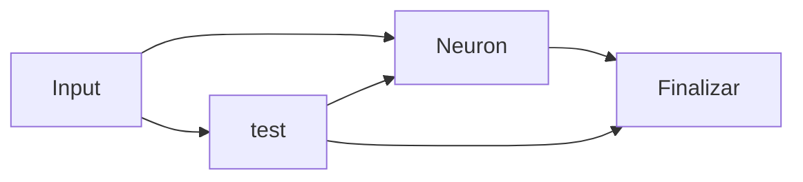

# ClarifyJS

ClarifyJS es un generador de sitios de documentación moderno construido sobre Astro. Está diseñado para ser rápido, flexible y fácil de usar, similar a Docusaurus pero aprovechando las últimas tecnologías web.

## Contents

## 쯇or qu칠 ClarifyJS?

- Rendimiento: Construido con Astro, ClarifyJS ofrece sitios web increíblemente rápidos por defecto.
- Experiencia de Desarrollador: Disfruta de la simplicidad y el poder de Astro y su ecosistema.
- Personalizable: Adapta fácilmente la apariencia y funcionalidad a tus necesidades.
- Basado en Markdown: Escribe tu documentación en Markdown, un formato simple y ampliamente utilizado.

> [!NOTE]  
> Diagrama de flujo 😊



## ejemplo de curl

```bash title="Token"
curl --request GET \
  --url https://test/api/v1/token \
  --body '{"username": "{{User.username}}", "password": "{{User.password}}"}'

```

```bash title="CURL"
curl --request GET \
  --url https://test/api/v1/teams/{{Team.id}} \
  --header 'api_token: {{Token.token}}'
```

## 쯈u칠 es ClarifyJS?

ClarifyJS es un generador de sitios de documentación moderno construido sobre Astro. Está diseñado para ser rápido, flexible y fácil de usar, similar a Docusaurus pero aprovechando las últimas tecnologías web.

## 쯇or qu칠 ClarifyJS?

- **Rendimiento:** Construido con Astro, ClarifyJS ofrece sitios web increíblemente rápidos por defecto.
- **Experiencia de Desarrollador:** Disfruta de la simplicidad y el poder de Astro y su ecosistema.
- **Personalizable:** Adapta fácilmente la apariencia y funcionalidad a tus necesidades.
- **Basado en Markdown:** Escribe tu documentación en Markdown, un formato simple y ampliamente utilizado.

## 쯈u칠 es ClarifyJS?

ClarifyJS es un generador de sitios de documentación moderno construido sobre Astro. Está diseñado para ser rápido, flexible y fácil de usar, similar a Docusaurus pero aprovechando las últimas tecnologías web.

> [!NOTE]  
> Highlights information that users should take into account, even when skimming.

> [!TIP]
> Optional information to help a user be more successful.

> [!IMPORTANT]  
> Crucial information necessary for users to succeed.

> [!WARNING]  
> Critical content demanding immediate user attention due to potential risks.

> [!CAUTION]
> Negative potential consequences of an action.
